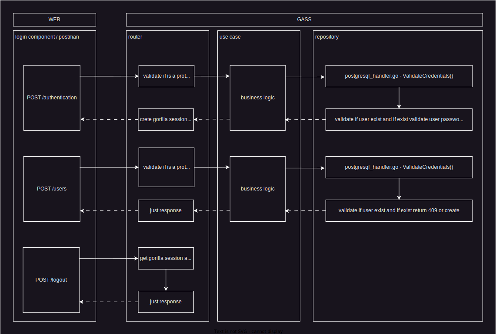

# Gorilla Session Authentication/Authorization (GSAA)

GSAA is a secure authentication system built with Go, Gorilla Sessions, JWT, PostgreSQL, and Clean Architecture.

## Table of Contents

- [Description](#description)
- [Diagram](#diagram)
- [Usage](#usage)
- [Routes](#routes)
- [PostgreSQL Tables](#postgresql-tables)
- [Postman Collection](#postman-collection)

## Description

GSAA provides a robust and secure authentication system with the following key features:

- User registration and account creation
- User login and session management
- User logout and session invalidation
- Token-based authentication using JWT (JSON Web Tokens)
- PostgreSQL database for data storage
- Clean Architecture design principles for modular and maintainable code

## Diagram

<div align="center">
    
</div>

## Usage

Follow the steps below to run the GSAA application:

1. Clone the repository:

```shell
git clone https://github.com/jeferagudeloc/gorilla-sessions-auth.git
```

2. Navigate to the project directory:

```shell
cd gorilla-sessions-auth
```

3. Build and run the application using Docker Compose:

```shell
docker-compose up --build
```

This command will start the application along with the PostgreSQL database and Nginx proxy server.

4. Access the application through your web browser:

```
http://localhost:18080
```

This will open the GSAA web interface where you can register, log in, and manage user accounts.

## Routes

The following routes are available in the GSAA application:

- `/health`: Performs a health check to ensure the server is running.
- `/authentication`: Handles user authentication by validating credentials and generating a session token.
- `/logout`: Logs out the user by invalidating the session token and removing session data.
- `/users`: Handles user creation by creating a new user account.

## PostgreSQL Tables

The GSAA application uses the following tables in the PostgreSQL database:

- `users`: Stores user account information, including name, email, password, and status.
- `companies`: Stores company information, linked to user accounts through a foreign key relationship.
- `profiles`: Stores user profile information, linked to user accounts through a foreign key relationship.
- `permissions`: Stores permission information for user profiles, linked to profiles through a foreign key relationship.

## Postman Collection

[gorilla-sessions-auth.postman_collection.json](docs/collection/gorilla-sessions-auth.postman_collection.json)